# evaluation sheet
---
## Signals

ctrl-C in an empty prompt should display a new line with a new prompt.

ctrl-\ in an empty prompt should not do anything.

ctrl-D in an empty prompt should quit minishell -> RELAUNCH!

ctrI-C in a prompt after you wrote some stuff should display a new line with a new prompt.

The buffer should be clean too. Press "Enter" to make sure nothing from the previous line is executed.

ctrl-D in a prompt after you wrote some stuff should not do anything.

ctrl-\ in a prompt after you wrote some stuff should not do anything.

Try ctrl-C after running a blocking command like cat without arguments or grep "something".

Try ctrl-\ after running a blocking command like cat without arguments or grep "something".

Try ctrl-D after running a blocking command like cat without arguments or grep "something".

Repeat multiple times using different commands.

If something crashes, select the "crash" flag.

If something doesn't work, select the "incomplete work" flag.

---

## Go Crazy and history

Type a command line, then use ctrl-C and press "Enter". The buffer should be clean and there should be nothing left to execute.

Can we navigate through history using Up and Down? Can we retry some command?

Execute commands that should not work like 'dsbksdgbksdghsd'. Ensure minishell doesn't crash and prints an error.

'cat | cat | ls' should behave in a "normal way".

Try to execute a long command with a ton of arguments.

Have fun with that beautiful minishell and enjoy it!

---

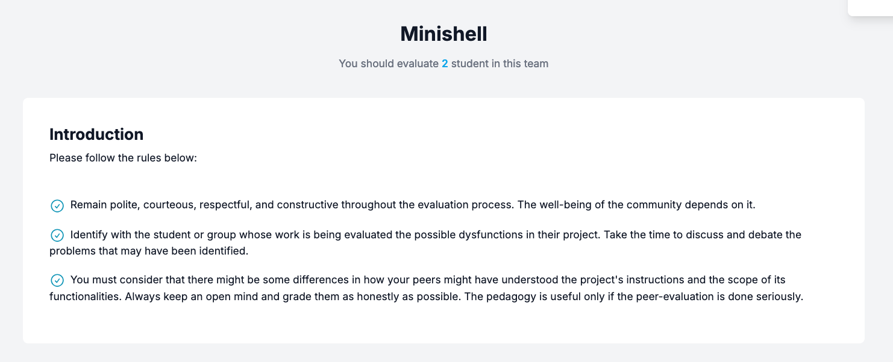
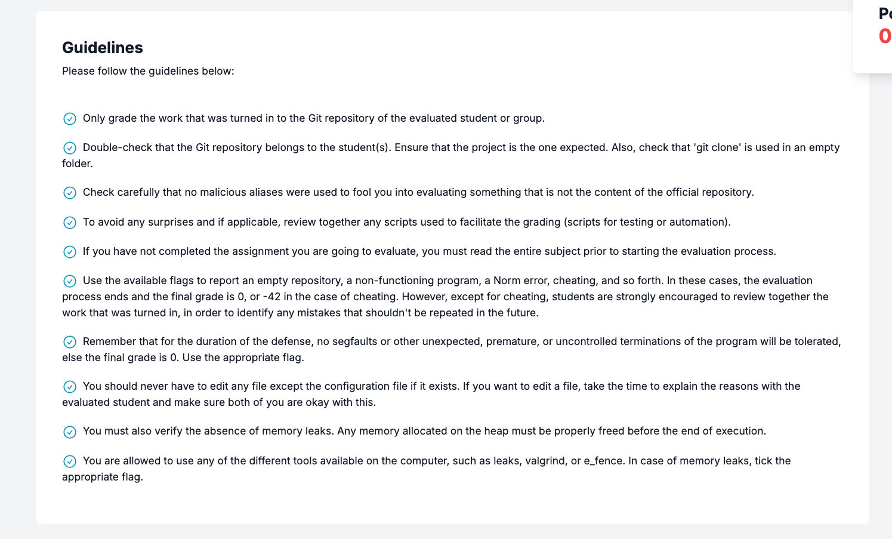
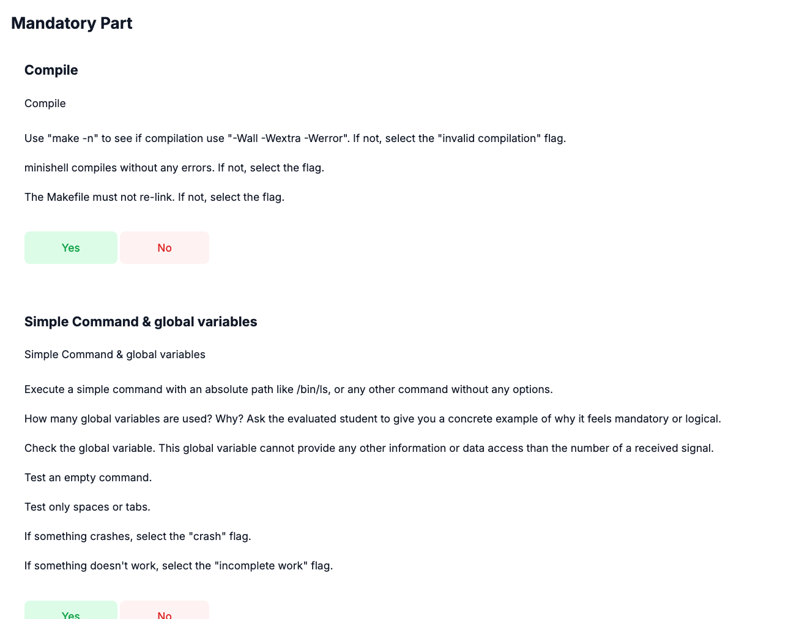
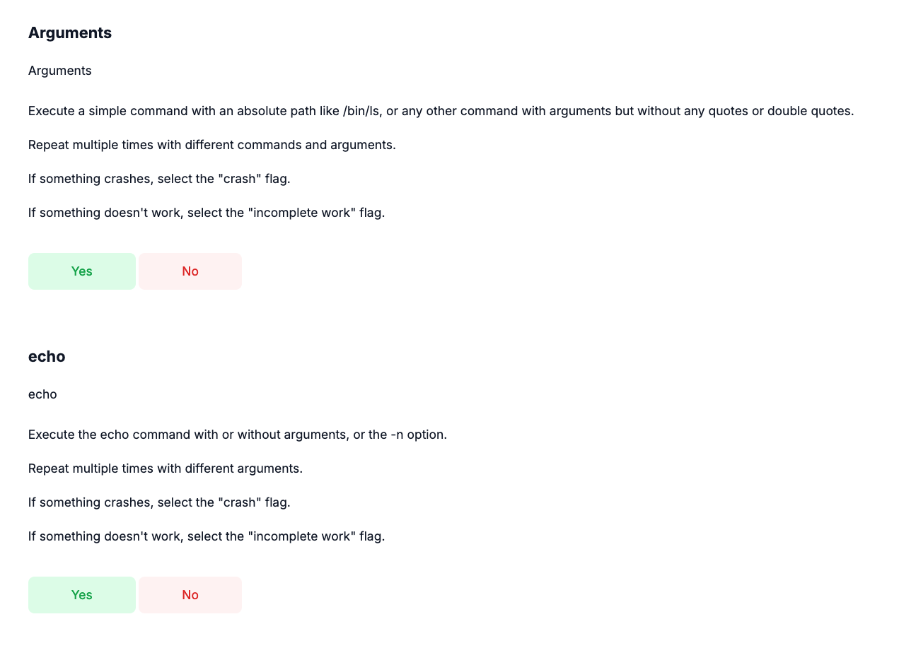
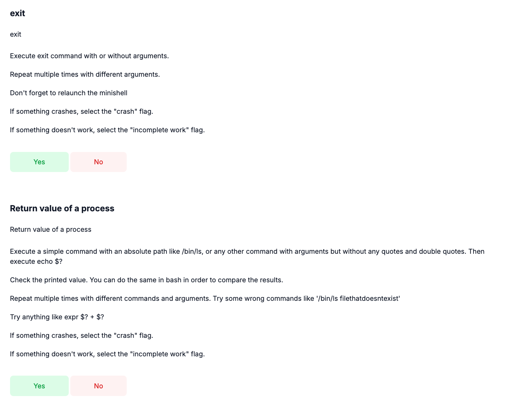
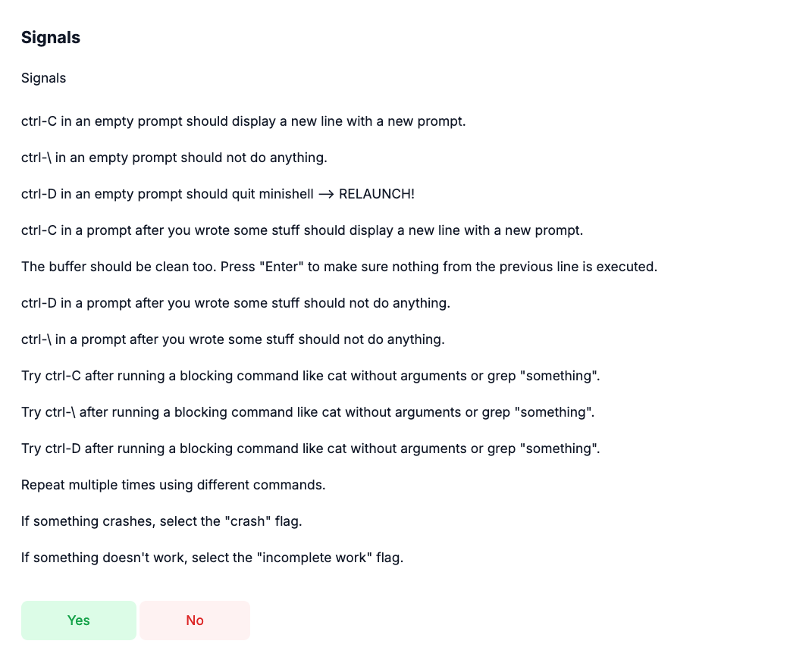
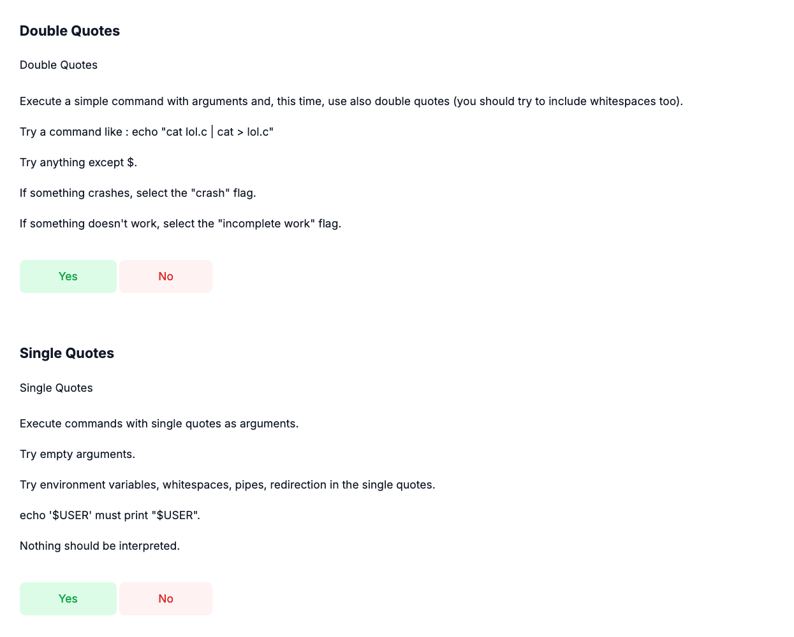
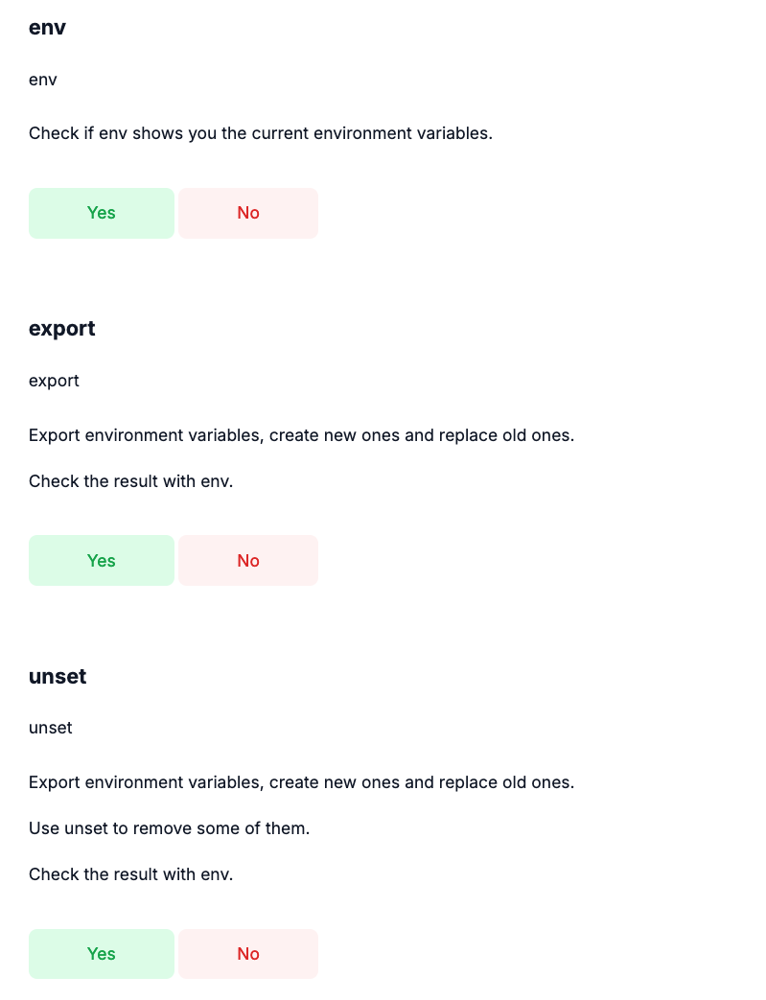
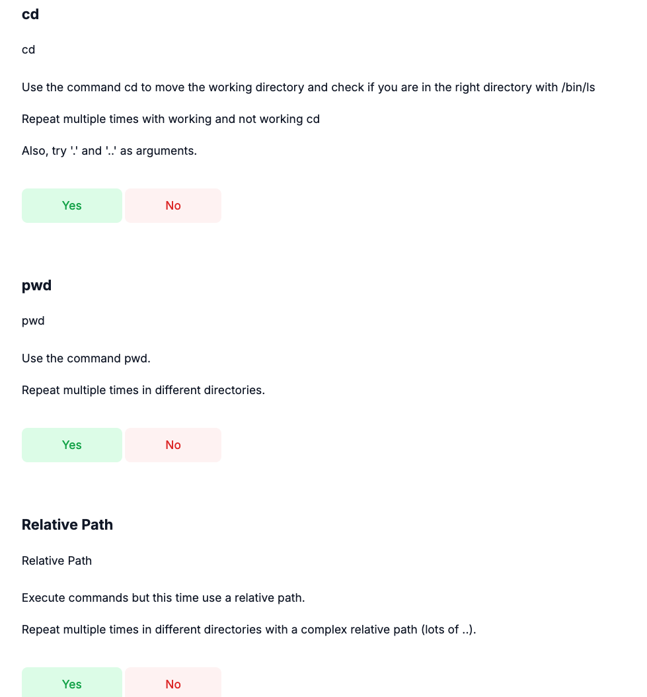
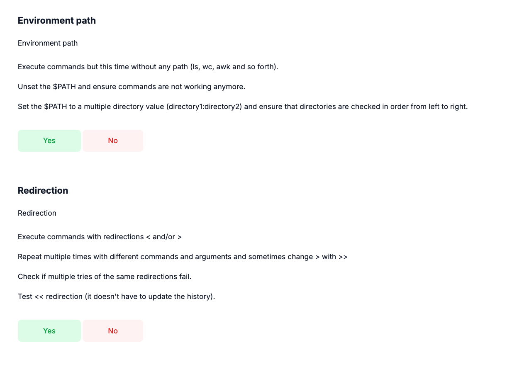
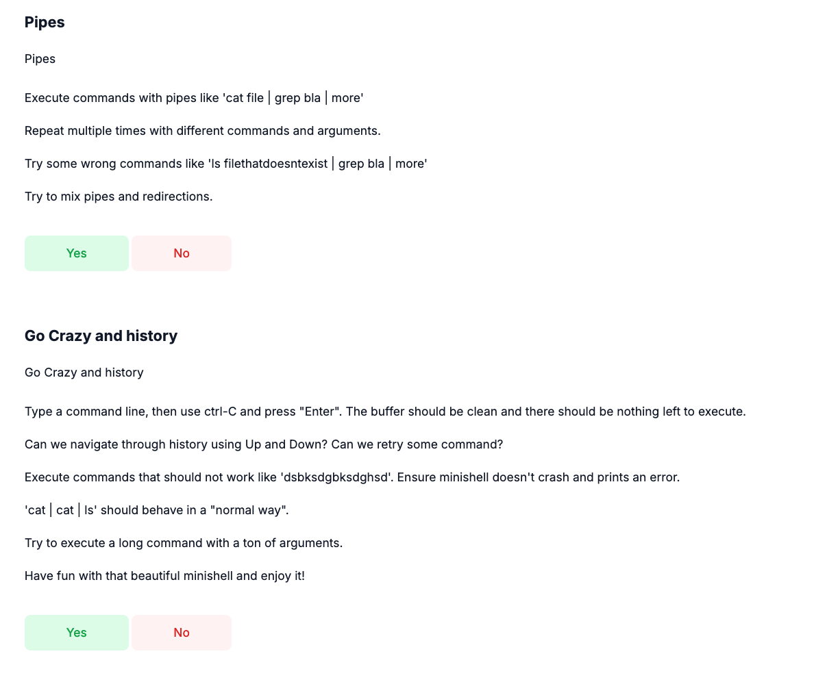
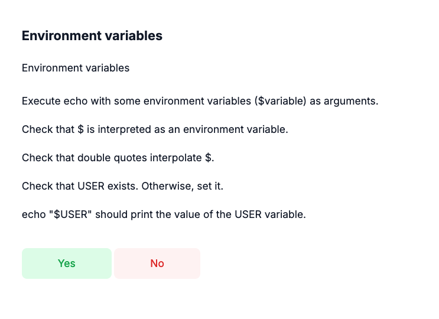
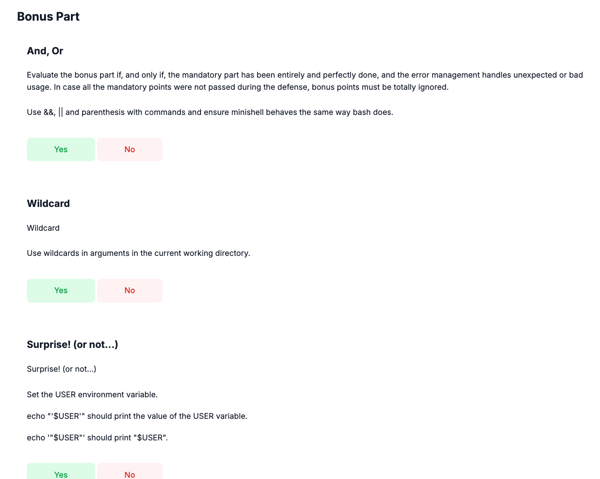
